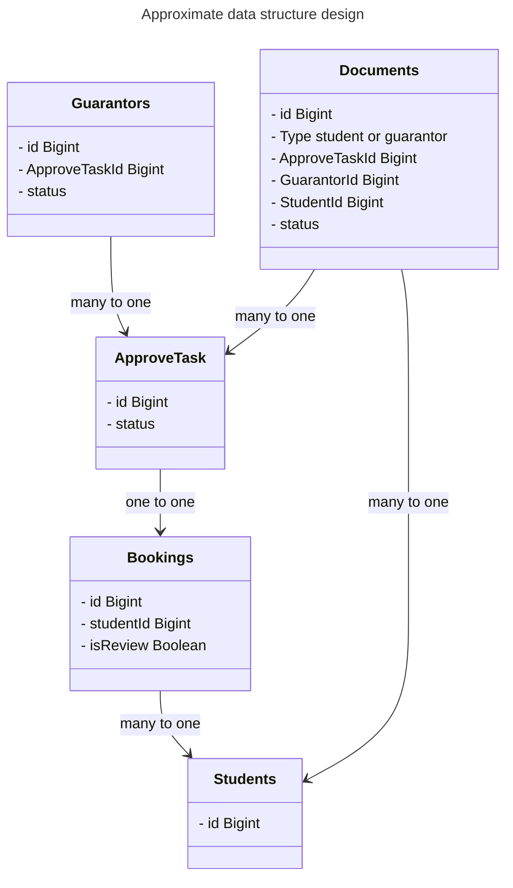

# plan-poker

其他适合结合 "Plan Poker" 和 "Retro" 的英文项目名称可以是：

- **"SprintSync"**  
- **"AgileBoard"**  
- **"TeamPulse"**  
- **"CollabSprint"**  
- **"RetroPoker"**  
- **"PlanRetro"**  
- **"AgileFusion"**  
- **"SprintFlow"**  
- **"TeamSprint"**  
- **"AgileBridge"**  

这些名称强调了敏捷开发、团队协作和项目管理的主题。
For a project combining "Plan Poker" and "Retro," a suitable English project name could be **"AgileCollab"** or **"SprintSuite"**, as these terms reflect collaboration and agile methodologies.

Here are more potential English project names for combining "Plan Poker" and "Retro":

- **"SprintDeck"**  
- **"AgileHive"**  
- **"RetroSync"**  
- **"PlanTogether"**  
- **"TeamAgility"**  
- **"CollabRetro"**  
- **"SprintBridge"**  
- **"AgileCircle"**  
- **"RetroBoard"**  
- **"PokerSprint"**  

Here are some project names closer to the theme of "team collaboration":

- **"TeamLink"**  
- **"CollabWorks"**  
- **"SyncTeam"**  
- **"TeamFlow"**  
- **"CollabHub"**  
- **"WorkTogether"**  
- **"TeamBridge"**  
- **"CollabCircle"**  
- **"UnifiedTeam"**  
- **"TeamConnect"**  

    
